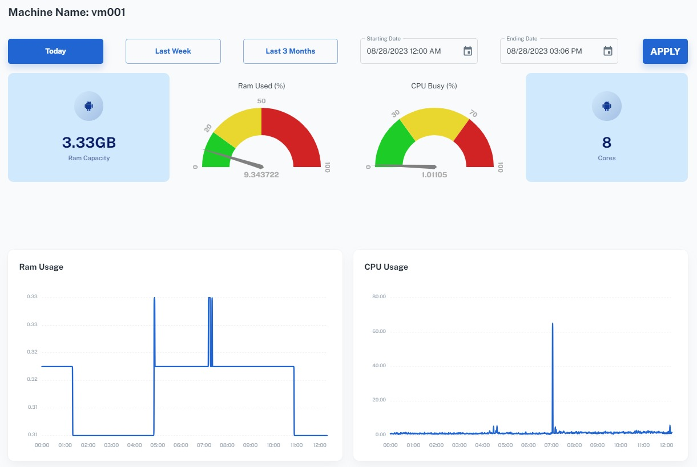
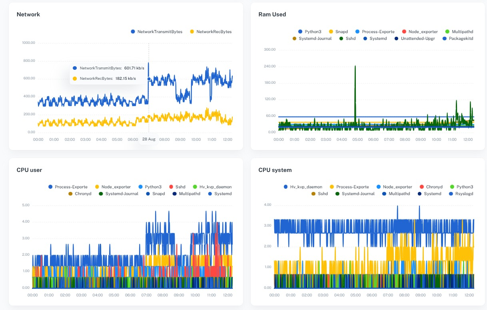
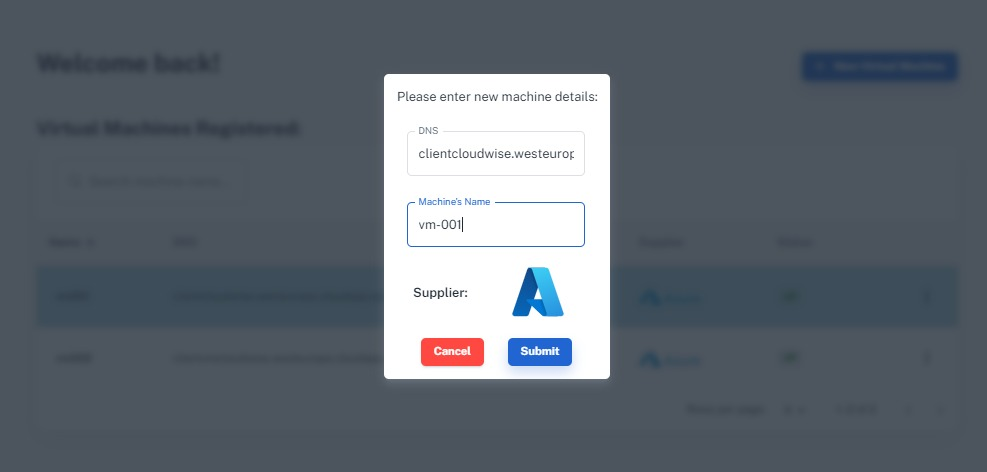
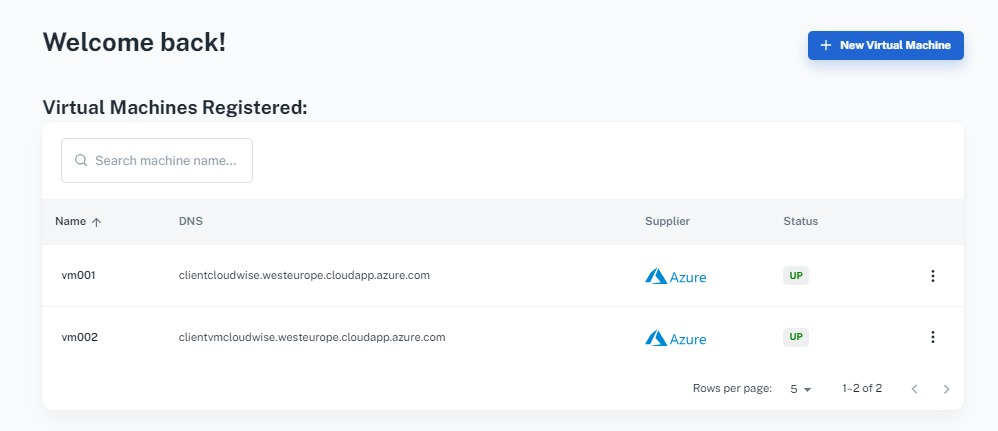

<a name="readme-top"></a>

<!-- PROJECT SHIELDS -->

<!-- PROJECT LOGO -->
<br />
<div align="center">
  <a href="https://github.com/ChenKlausner/ReadmeTemp">
    
  </a>
  <p align="center">
    Monitoring and Analyzing cloud-based virtual machines.
    <br />
    <a href="https://github.com/github_username/repo_name"><strong>Explore the docs »</strong></a>
    <br />
    <br />
    <a href="https://github.com/github_username/repo_name">View Demo</a>
    ·
    <a href="https://github.com/github_username/repo_name/issues">Report Bug</a>
    ·
    <a href="https://github.com/github_username/repo_name/issues">Request Feature</a>
  </p>
</div>


<!-- TABLE OF CONTENTS -->
<details>
  <summary>Table of Contents</summary>
  <ol>
    <li>
      <a href="#about-the-project">About The Project</a>
      <ul>
        <li><a href="#built-with">Built With</a></li>
      </ul>
    </li>
    <li>
      <a href="#getting-started">Getting Started</a>
      <ul>
        <li><a href="#installing-and-running-the-node-exporter">Installing and running the Node Exporter</a></li>
        <li><a href="#installing-and-running-the-process-exporter">Installing and running the Process Exporter</a></li>
      </ul>
    </li>
    <li><a href="#usage">Usage</a></li>
    <li><a href="#demo">Demo</a></li>
    <li><a href="#contributing">Contributing</a></li>
    <li><a href="#license">License</a></li>
    <li><a href="#contact">Contact</a></li>
    <li><a href="#acknowledgments">Acknowledgments</a></li>
  </ol>
</details>


<!-- ABOUT THE PROJECT -->
## About The Project

The project focuses on expanding the capabilities of cloud-based virtual machines monitoring. With the aim of assisting users in efficiently tracking performance metrics on their virtual machines, we have embraced the use of the Prometheus ecosystem to enhance our project's monitoring capabilities, leveraging its robust features and functionalities.

Our primary objective is to develop custom dashboards that provide comprehensive insights into the general performance of cloud-based virtual machines, as well as individual processes.
To achieve this, we employ the use of machine learning algorithms. These algorithms analyze the collected data and generate predictions on virtual machines performance.
These predictions serve to empower users by identifying and addressing potential issues before they occur, enabling effective resolutions.

<p align="right">(<a href="#readme-top">back to top</a>)</p>


### Built With

* ASP.NET (C#)
* React.js
* Prometheus
* Microsoft Azure
* MongoDB

<p align="right">(<a href="#readme-top">back to top</a>)</p>


<!-- GETTING STARTED -->
## Getting Started

Welcome to CloudWise! CloudWise is a monitoring platform that gathers metrics from monitored targets by scraping data from HTTP endpoints on these targets. As you begin your journey, your first step will be to install Node Exporter, which provides a diverse range of hardware and kernel-related metrics. Afterward, you'll proceed to install the Process Exporter, designed to capture process-specific metrics.

### Installing and running the Node Exporter

The Prometheus Node Exporter is a single static binary that you can install via tarball. Once you've downloaded it from the [Prometheus downloads page](https://prometheus.io/download/#node_exporter), extract it, and run it:

  ```sh
  wget https://github.com/prometheus/node_exporter/releases/download/v1.6.1/node_exporter-1.6.1.linux-amd64.tar.gz
  tar xvfz node_exporter-1.6.1.linux-amd64.tar.gz
  cd node_exporter-1.6.1.linux-amd64
  ./node_exporter &
  ```

### Installing and running the Process Exporter
1. Download Process Exporter
    ```sh
   wget https://github.com/ncabatoff/process-exporter/releases/download/v0.7.10/process-exporter-0.7.10.linux-amd64.tar.gz
    ```
2. Unpack Process Exporter Binary
    ```sh
   tar -xvf process-exporter-0.7.10.linux-amd64.tar.gz
     ```
4. Create Process Exporter Configuration File
    ```sh
   sudo vi /etc/process_exporter/process.yaml
    ```
    ```sh
   process_names:
    - name: "{{.Comm}}"
    cmdline:
    - '.+'
    ```
4. Run
   ```sh
   cd process-exporter-0.7.10.linux-amd64
   ./process-exporter -config.path=process.yml &
   ```
   
<p align="right">(<a href="#readme-top">back to top</a>)</p>


<!-- USAGE EXAMPLES -->
## Usage

The following shows an example of our dashboard which queries Prometheus for data:




Adding a data source:



Watching Client's Virtual Machines:



<p align="right">(<a href="#readme-top">back to top</a>)</p>


<!-- ROADMAP -->
## Demo


<p align="right">(<a href="#readme-top">back to top</a>)</p>


<!-- CONTRIBUTING -->
## Contributing

Contributions are what make the open source community such an amazing place to learn, inspire, and create. Any contributions you make are **greatly appreciated**.

If you have a suggestion that would make this better, please fork the repo and create a pull request. You can also simply open an issue with the tag "enhancement".
Thanks again!

1. Fork the Project
2. Create your Feature Branch (`git checkout -b feature/AmazingFeature`)
3. Commit your Changes (`git commit -m 'Add some AmazingFeature'`)
4. Push to the Branch (`git push origin feature/AmazingFeature`)
5. Open a Pull Request

<p align="right">(<a href="#readme-top">back to top</a>)</p>


<!-- LICENSE -->
## License

Distributed under the MIT License. See `LICENSE.txt` for more information.

<p align="right">(<a href="#readme-top">back to top</a>)</p>


<!-- CONTACT -->
## Contact

Chen Klausner - [LinkedIn Profile](https://www.linkedin.com/in/chen-klausner/) - chen762@gmail.com

Guy Yomtov - [LinkedIn Profile](https://www.linkedin.com/in/guy-yomtov-062324162/) - guyyomtov13@gmail.com

Almog Raccah - [LinkedIn Profile](https://www.linkedin.com/in/almog-raccah-6b24171ba/) - almogrc1@gmail.com

Project Link: [https://github.com/guyyomtov/Server-cloudata](https://github.com/guyyomtov/Server-cloudata)

<p align="right">(<a href="#readme-top">back to top</a>)</p>


<!-- ACKNOWLEDGMENTS -->
## Acknowledgments

* [Prometheus](https://prometheus.io/)

<p align="right">(<a href="#readme-top">back to top</a>)</p>

